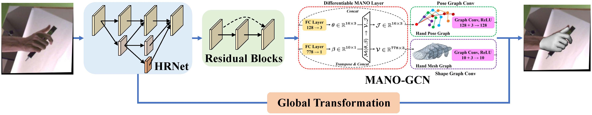
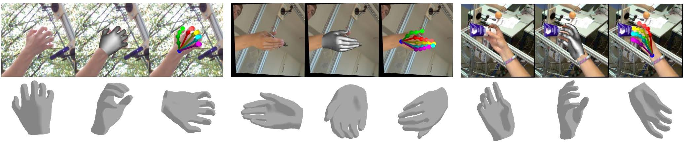

# MANO-GCN

## Introduction
This is the implementation of our paper: [Capturing Implicit Spatial Cues for Monocular 3D Hand Reconstruction (ICME 2021 Oral)](https://ieeexplore.ieee.org/abstract/document/9428299).



## Installation

The installation of this repo is very simple, just install PyTorch and several other python libraries.

```python
# 0. (Optional) We highly recommend that you install in a clean conda environment:

Install Anaconda3 from https://anaconda.org/

conda create -n manogcn python=3.8

# 1. Install PyTorch:

Please follow the official website: https://pytorch.org/

An example: pip install torch==1.9.0+cu111 torchvision==0.10.0+cu111 -f https://download.pytorch.org/whl/torch_stable.html

# 2. Install some required python libraries:

pip install opencv-python tqdm yacs scipy
```

## Dataset

We support [FreiHAND](https://lmb.informatik.uni-freiburg.de/projects/freihand/) and [HO3D](https://www.tugraz.at/index.php?id=40231) datasets. Please download them and create a softlink like:

```shell
ln -s ~/data/freihand/ datasets/
```

## Training and Inference

We provide scripts for easily training and inference. Please check [scripts/train.sh](scripts/train.sh) and [scripts/eval.sh](scripts/eval.sh), such as:

```shell
config_file="configs/manogcnx3_1x_freihand.yaml"
gpus=0,1
gpun=2

# ------------------------ need not change -----------------------------------
CUDA_VISIBLE_DEVICES=$gpus python -m torch.distributed.launch --nproc_per_node=$gpun --master_port=$((RANDOM + 10000)) \
    train_net.py --config-file $config_file
```

Before training, you may download the pretrained HRNet model pose_hrnet_w32_384x288.pth from https://github.com/leoxiaobin/deep-high-resolution-net.pytorch and put it here.

## Visualization

We leverage [PyTorch3D](https://pytorch3d.org/) to render the hand mesh. Please install it and check [pytorch3d_plot.py](pytorch3d_plot.py).



## Acknowledgement

```
@INPROCEEDINGS{manogcn,
  author={Wu, Qi and Chen, Joya and Zhou, Xu and Yao, Zhiming and Yang, Xianjun},
  booktitle={ICME}, 
  title={Capturing Implicit Spatial Cues for Monocular 3D Hand Reconstruction}, 
  year={2021},
  pages={1-6}
}
```